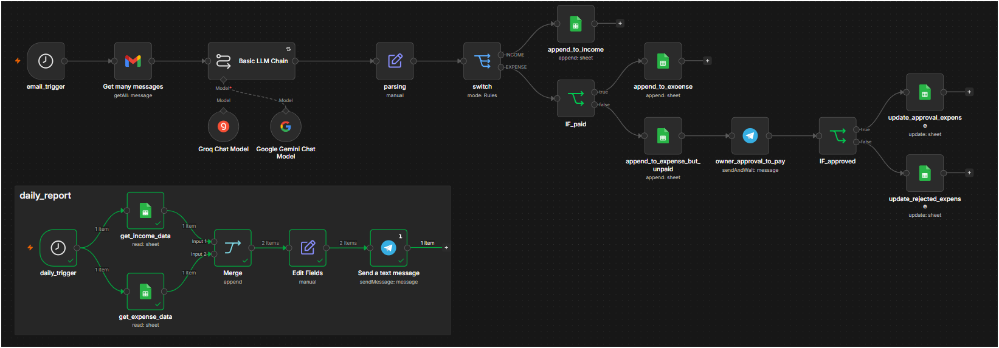
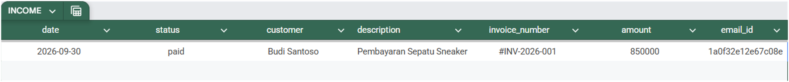
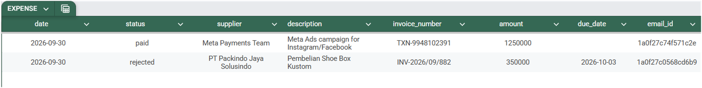
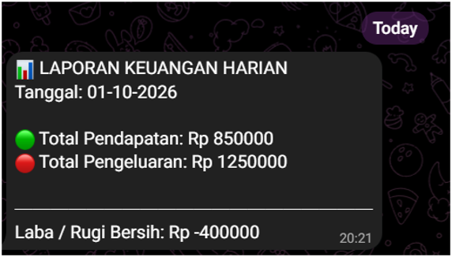

# Cashflowmation
## Tracking Keuangan UMKM Otomatis

Sistem pemantau pendapatan dan pengeluaran otomatis berbasis email transaksi untuk efisiensi operasional *solo owner* UMKM.

**N8N Workflow** https://raliefr.app.n8n.cloud/workflow/HSHx17e77Pw0QsAg 
**Engine:** n8n + AI LLM (Gemini)  



---

## Latar Belakang & Masalah

Banyak *owner* UMKM skala kecil mengelola seluruh operasional bisnis seorang diri (*solo owner*) tanpa bantuan admin keuangan. Hal ini sering memicu beberapa kendala:
- **Pencatatan Manual & Terlewat:** Input invoice dan tagihan secara manual rentan lupa atau salah ketik.
- **Risiko Cashflow:** Pembayaran tertunda atau tagihan tidak terdeteksi memicu kemacetan arus kas.
- **Kurang Visibilitas Real-time:** Membutuhkan waktu lama hanya untuk rekap keuangan bulanan/harian.

### Solusi yang Ditawarkan
- **Hemat Waktu:** Memangkas proses rekap manual satu per satu dari nota ke spreadsheet.
- **Data Terorganisasi:** Transaksi dari email/nota diekstrak dan tersimpan rapi di Google Sheets.
- **Real-time & Akurat:** Status arus kas ter-update otomatis saat ada email masuk dan dikirimkan via notifikasi instan.

---

## Workflow & Cara Kerja

workflow berjalan secara otomatis dalam 4 tahap utama:

[ Gmail Trigger ] ➡️ [ AI Extraction (Gemini) ] ➡️ [ Spreadsheet Sync ] ➡️ [ Telegram Alert ]


1. **Gmail Trigger:** Mendeteksi email masuk secara periodik (*polling* 5 menit sekali) dengan filter kata kunci seperti *"Invoice"*, *"Pembayaran"*, atau *"Tagihan"*.
2. **AI Extraction:** Gemini AI menganalisis isi email mentah dan mengekstrak nominal, tanggal, kategori, serta status ke dalam format JSON terstruktur.
3. **Spreadsheet Sync:** Memasukkan baris transaksi baru secara otomatis ke lembar *Income* atau *Expense* di Google Sheets.
4. **Telegram Alert:** Mengirimkan notifikasi ringkasan konfirmasi transaksi dan laporan harian langsung ke aplikasi Telegram owner.

---

## Technology Stack

| Tool | Peran & Alasan Pemilihan |
| :--- | :--- |
| **n8n** | Orchestrator utama workflow untuk pemicu email, eksekusi AI, serta integrasi API yang stabil. |
| **Gemini AI Model** | Model LLM efisien dan hemat biaya untuk mengolah teks email acak menjadi data JSON presisi. |
| **Google Sheets** | Database/ledger sederhana yang mudah diakses dan dikelola tanpa biaya tambahan. |
| **Telegram Bot** | Kanal notifikasi instan untuk konfirmasi transaksi dan laporan kas harian. |

---

## AI Prompt Design

```
Kamu adalah asisten ekstraksi data keuangan untuk sistem akuntansi UMKM penjualan sepatu.

Tugas utama kamu adalah menganalisis teks e-mail yang masuk, lalu mengekstraksi informasi penting terkait transaksi keuangan ke dalam format JSON tunggal secara presisi.

--- DATA EMAIL ---
ID Email: {{ $json.id }}
Subject: {{ $json.Subject }}
Body Email:
{{ $json.text || $json.html || $json.snippet }}
------------------

### ATURAN EKSTRAKSI FIELD:
1. "date": Tanggal diterbitkannya e-mail/invoice (Format: YYYY-MM-DD). Jika tidak ditemukan, gunakan tanggal e-mail masuk.
2. "type": Tentukan tipe transaksi. Isikan SALAH SATU:
   - "income"  : Jika transaksi merupakan penjualan produk/sepatu ke customer/reseller.
   - "expense" : Jika transaksi merupakan pengeluaran/pembelian bahan baku, iklan, kurir, atau operasional dari supplier/vendor.
3. "status": Tentukan status pembayaran. Isikan SALAH SATU:
   - "paid"    : Jika transaksi/tagihan SUDAH DIBAYAR ATAU berupa bukti pembayaran (receipt/pembayaran lunas).
   - "unpaid"  : Jika e-mail berisi tagihan/faktur yang BELUM DIBAYAR (masih ada jatuh tempo/pending payment).
4. "sender": Nama pihak ketiga. Isikan nama Customer/Reseller (jika income) ATAU nama Vendor/Supplier/Platform (jika expense).
5. "description": Ringkasan singkat mengenai transaksi (Contoh: "Pembelian Bahan Baku Kulit", "Facebook Ads", "Invoice Sepatu Sneaker Size 42").
6. "invoice_number": Nomor invoice, faktur, atau kuitansi (Contoh: "INV/2026/10/001"). Jika tidak ditemukan, isikan null.
7. "amount": Cari nominal angka total transaksi dari Body Email atau Subject. Cari angka di sekitar kata "Total", "Harga", "Rp", "Nominal", "Pembayaran", atau daftar produk. Wajib hapus semua simbol mata uang (Rp, $), titik, koma, dan spasi, lalu ubah ke angka murni bertipe NUMBER. Jika benar-benar tidak ditemukan nominal angka sama sekali, barulah isi 0.
8. "due_date": Tanggal jatuh tempo pembayaran (Format: YYYY-MM-DD). Wajib diisi jika status = "unpaid". Jika status = "paid" atau tidak ada, isikan null.
9. "email_id": ID unik e-mail dari sistem Gmail.

### ATURAN FORMAT OUTPUT:
- Balas HANYA dengan objek JSON murni yang valid.
- JANGAN sertakan teks pengantar, penutup, atau markdown codeblock seperti ```json ... ```.

### FORMAT JSON OUTPUT:
{
  "date": "YYYY-MM-DD",
  "type": "income | expense",
  "status": "paid | unpaid",
  "sender": "string",
  "description": "string",
  "invoice_number": "string",
  "amount": "number",
  "due_date": "YYYY-MM-DD",
  "email_id": "string"
}
```

### Strategi Desain Prompt:

1. **Role Persona:** Memberikan identitas spesifik agar AI fokus pada tugas akuntansi UMKM.
2. **Instruksi Spesifik:** Mencegah AI menambahkan komentar atau penjelasan teks di luar JSON.
3. **Output JSON Ketat:** Memastikan output dapat dibaca secara langsung oleh node parser n8n tanpa *error*.

---

## Output & Screenshot

### 1. Ledger Google Sheets (Database)

Data otomatis terpisah sesuai tipe transaksi (*Income* / *Expense*):



* **Income Sheet:** Mencatat tanggal, status, customer/sumber, deskripsi, nomor invoice, amount, dan email_id.



* **Expense Sheet:** Mencatat pengeluaran, supplier, deskripsi, amount, status (*paid/unpaid/rejected*), dan tanggal jatuh tempo (*due_date*).

### 2. Ringkasan Laporan Harian di Telegram

Bot Telegram akan mengirimkan rekap kas harian secara otomatis:



---

## Cara Menggunakan (Setup)

1. **Import Workflow n8n:**
* Clone repository ini.
* Import file JSON workflow n8n ke instance n8n kamu.


2. **Setup Credentials:**
* Sambungkan credential **Gmail OAuth2**, **Google Sheets**, dan **Telegram Bot API**.
* Masukkan **Google Gemini API Key** pada node AI LLM.


3. **Konfigurasi Sheet:**
* Buat Google Sheets dengan dua tab bernama `INCOME` dan `EXPENSE` sesuai dengan header kolom pada dokumentasi.


4. **Aktifkan Workflow:**
* Turn on workflow n8n (*Active*).
